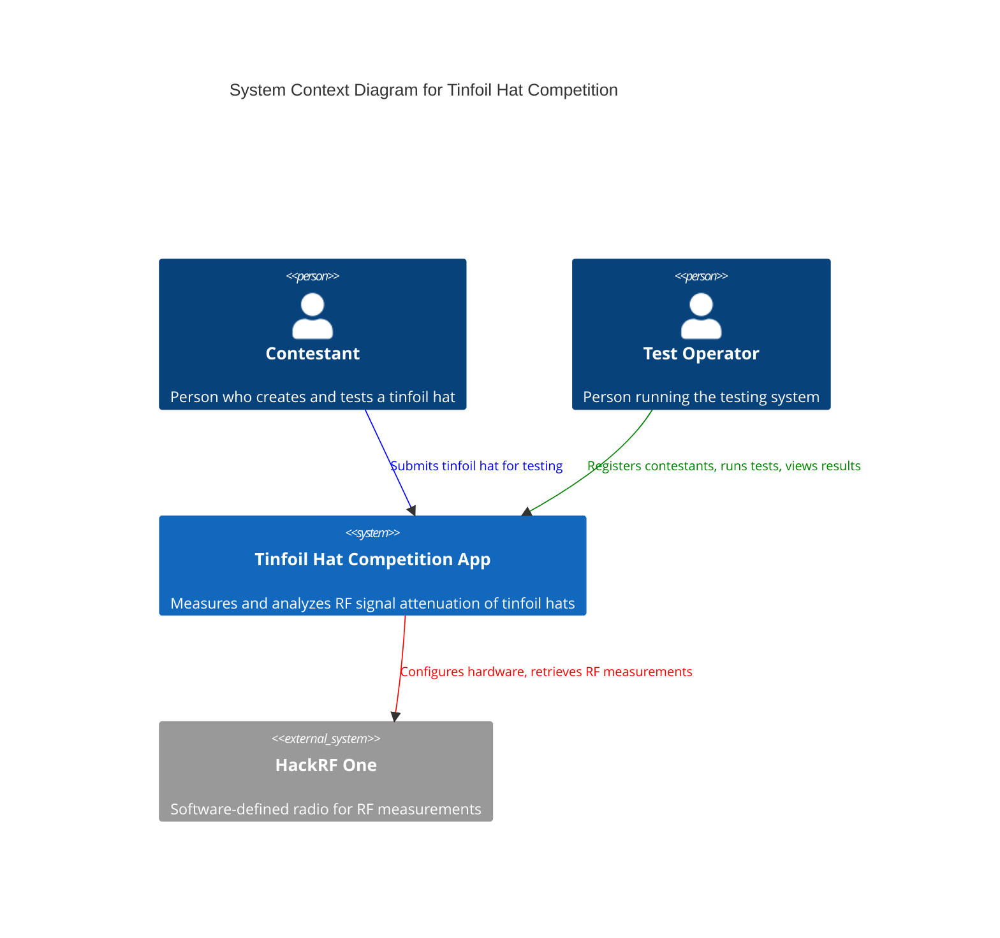
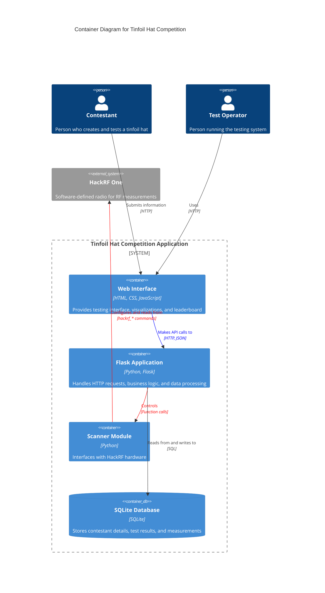
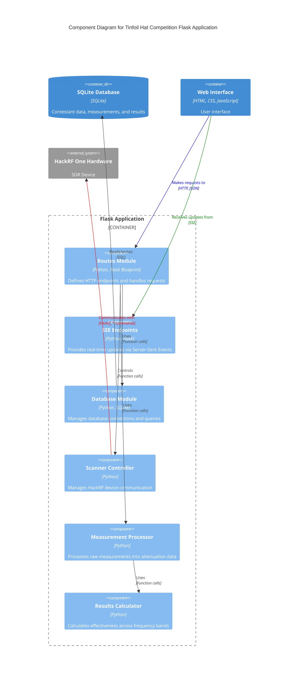
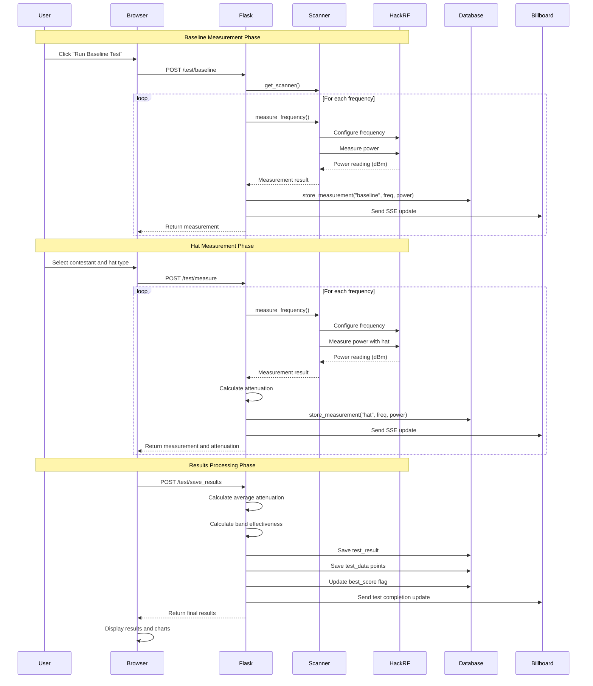
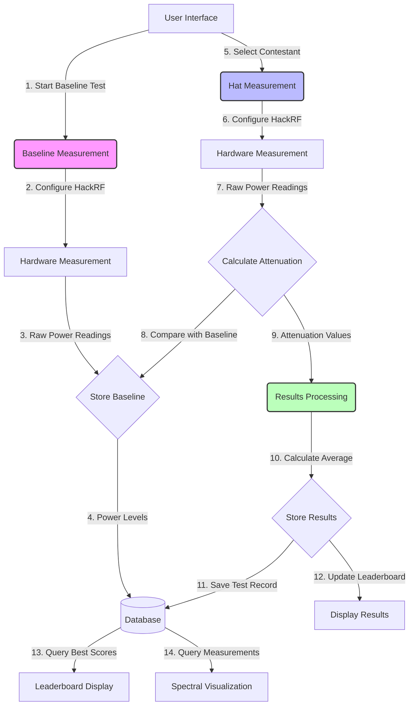

# Tinfoil Hat Competition


![Test Coverage]

A Flask web application for running and tracking Tinfoil Hat Competitions, originally built for Cyphercon in Milwaukee on April 3-4 2025.

## Overview

The Tinfoil Hat Competition tests the signal attenuation properties of contestant-made tinfoil hats. The application:
- Manages contestant registration
- Controls HackRF One testing sequence
- Calculates attenuation scores
- Displays results on a leaderboard
- Visualizes test results in real-time

## Recent Updates

### JavaScript Modularization (April 2025)
- Restructured the monolithic JavaScript in billboard.html into modular components:
  - `ChartManager.js`: Handles chart initialization, updates, and configuration
  - `DataManager.js`: Manages test data tracking and processing
  - `LeaderboardManager.js`: Handles leaderboard updates and display
  - `UIManager.js`: Manages UI updates and notifications
  - `EventHandler.js`: Processes all Server-Sent Events
  - `billboard.js`: Main application script that initializes and connects components
- Improved code organization with clear separation of concerns
- Enhanced maintainability with well-documented component interfaces
- Reduced complexity by isolating functionality into logical modules
- Added comprehensive JSDoc comments to all components

### UI and Testing Workflow Improvements (March 2025)
- Redesigned testing flow to separate baseline and hat measurement phases
- Added a dedicated "Continue to Hat Measurement" modal with contestant selection
- Improved chart labels to show frequency and common radio band names (e.g., "89 (FM Radio)")
- Reduced spacing between UI elements for better visual cohesion
- Added ability to register new contestants directly from the measurement flow
- Renamed "Run Test" button to "Run Baseline Test" for clarity
- Fixed modal layering issues to ensure proper interaction with overlapping modals
- Consistent terminology throughout the application (standardized on "contestant")

### Spectrum Analyzer Enhancements (March 2025)
- Improved chart label formatting to show frequencies with human-readable band names
- Added tooltips showing detailed frequency information and descriptions
- Adjusted chart container height and padding for better display
- Enhanced layout of results display for better readability
- Added more visual feedback during the measurement process

### Server-Side Calculation Improvements (March 2025)
- Moved all attenuation and effectiveness calculations to server-side for consistency
- Eliminated discrepancies between client and server calculations
- Improved accuracy by only considering valid measurements in calculations
- Enhanced data validation logic on server for more reliable results
- Standardized frequency band processing across all calculations

### Code Quality and Linting Improvements (March 2025)
- Updated code style configuration to use 120-character line length
- Fixed whitespace issues in SQL queries
- Improved exception handling using contextlib.suppress
- Modernized Ruff linting configuration
- Streamlined development workflow with targeted tox environments

### Real-time Measurement Functionality (March 2025)
- Added real-time frequency measurement endpoints
- Implemented a progress bar with current frequency display
- Visual feedback for measurement progress
- Interactive testing process with stop functionality
- Live chart updates as measurements are taken
- Enhanced frequency unit handling to ensure compatibility with HackRF

### Measurement and Error Handling Improvements
- Pure hardware measurements with no artificial simulation
- Fixed frequency unit conversion between MHz and Hz
- Added proper validation for HackRF's supported frequency range (1 MHz to 6 GHz)
- Enhanced error detection and recovery during measurements
- Better feedback for connection and measurement issues

## To-Do List for Improvements

### 1. Frontend Restructuring
- [x] Modularize the 2000+ line JavaScript in billboard.html into logical components (Chart, Leaderboard, EventHandling)
  - Completed: JS code has been modularized into ChartManager, DataManager, LeaderboardManager, UIManager, EventHandler, and billboard components
- [ ] Implement consistent error handling patterns across all frontend components
- [ ] Remove duplicate code in event handlers, particularly reset/error handling logic
- [ ] Create proper error boundaries around chart rendering operations
- [ ] Refactor the SSE event handling to reduce complexity
- [ ] Consider migrating to a proper frontend framework (Vue.js or React)

### 2. Backend Improvements
- [ ] Improve test coverage for routes.py (currently at 32%)
- [ ] Improve test coverage for scanner.py (currently at 47%)
- [ ] Fix SQLite timestamp converter deprecation warning
- [ ] Implement proper error handling for HackRF connection failures
- [ ] Create a more explicit API contract between frontend and backend
- [ ] Add input validation to all API endpoints

### 3. Architecture Enhancements
- [ ] Reduce tight coupling between frontend and backend
- [ ] Consider implementing WebSockets instead of SSE for more reliable bidirectional communication
- [ ] Implement proper dependency injection for better testability
- [ ] Create a service layer between routes and database access
- [ ] Separate data access logic from business logic
- [ ] Document API endpoints with OpenAPI/Swagger

### 4. Performance Optimization
- [ ] Optimize chart rendering for large datasets
- [ ] Implement pagination for leaderboard data
- [ ] Add caching for frequently accessed data
- [ ] Optimize SQLite queries with proper indexes
- [ ] Reduce unnecessary DOM manipulations in the frontend

### 5. Code Quality & Maintenance
- [ ] Implement TypeScript for frontend code to improve type safety
- [ ] Add JSDoc comments to JavaScript functions
- [ ] Create comprehensive integration tests for the testing workflow
- [ ] Standardize error messages across the application
- [ ] Implement logging for debugging and monitoring
- [ ] Create Docker container for easier deployment
- [ ] Add automated UI testing

### 6. User Experience Improvements
- [ ] Improve mobile responsiveness
- [ ] Add keyboard shortcuts for common operations
- [ ] Implement better visual feedback for system status
- [ ] Create a dark/light theme toggle
- [ ] Add user preferences for chart display options
- [ ] Implement accessibility improvements (ARIA attributes, keyboard navigation)

## Requirements

- Python 3.13+ (primary development on Python 3.13)
- HackRF One with telescoping antenna
- Mannequin head for testing
- HackRF system tools

### Supported Python Versions
The application is tested primarily with Python 3.13. While the codebase should be compatible with future Python versions, these versions are not actively tested in the CI pipeline. If you encounter any issues with other Python versions, please report them.

## Hardware Setup

1. **Connect the HackRF One to your computer's USB port**

2. **Install HackRF Tools**

   - **MacOS**:
     ```
     brew install hackrf
     ```

   - **Ubuntu/Debian**:
     ```
     sudo apt-get install hackrf
     ```

   - **Windows**:
     Download and install from https://github.com/greatscottgadgets/hackrf/releases

3. **Verify HackRF connection**:
   ```
   hackrf_info
   ```
   
   The output should show your HackRF One device details.

## Software Setup

1. **Create and activate a virtual environment**:
   ```
   python -m venv venv
   source venv/bin/activate  # On Windows: venv\Scripts\activate
   ```

2. **Install the package and dependencies**:
   ```
   pip install -e .
   ```

3. **Initialize the database**:
   ```
   python -m tinfoilhat.init_db
   ```

## Running the Application

Start the application with:
```
python run.py
```

Then open your browser and navigate to http://localhost:8000

## Usage Instructions

1. **Register Contestants**: Use the "Add Contestant" button to enter participant details.

2. **Testing Process**:
   - Click "Run Baseline Test" to begin the testing process
   - The system will run a baseline test without the hat
   - When complete, you'll be prompted to place the hat on the mannequin/test subject
   - Select a contestant from the dropdown (or add a new one)
   - Choose the hat type (Classic or Hybrid)
   - The system will complete the test and automatically save the results
   - Review the results showing the average attenuation and effectiveness across frequency bands

3. **Viewing Results**:
   - Results appear automatically after test completion
   - Check the effectiveness across different frequency ranges
   - Note the frequencies where the hat performed best/worst
   - The leaderboard updates automatically if this is the contestant's best score

## Leaderboard

The leaderboard displays contestants ranked by the effectiveness of their tinfoil hats, measured by RF signal attenuation in dB.

## Hardware Recommendations

For optimal performance:
- Place the HackRF at a consistent distance from the test subject (about 30-50cm works well)
- Use an antenna suitable for the frequency ranges being tested
- Ensure a consistent testing environment with minimal RF interference
- Keep the HackRF in the same orientation throughout all tests
- Make sure the HackRF device has sufficient power (USB 3.0 port recommended)

## How It Works

### Testing Process

1. A contestant creates a tinfoil hat
2. The operator runs a baseline test to measure ambient RF signals
3. The contestant places their hat on the mannequin head
4. The operator selects the contestant and hat type from the modal
5. The system measures RF signals with the hat in place
6. The application calculates attenuation by comparing baseline and hat measurements
7. Results show overall effectiveness and performance across different frequency bands
8. If this is the contestant's best score, it's saved to the leaderboard

### Hat Types

The system supports two types of hats:
- **Classic**: Made with tinfoil only
- **Hybrid**: Made with tinfoil plus other materials

### Real Measurements

The application uses the HackRF One device to make real RF measurements:
1. For each frequency, the HackRF captures I/Q samples
2. The samples are processed to calculate power levels in dBm
3. Baseline and hat measurements are compared to calculate attenuation
4. Results are displayed in real-time as measurements progress
5. Statistics are calculated to show effectiveness across frequency bands

## Detailed System Workflow

The Tinfoil Hat Competition application uses a sophisticated workflow to handle the testing process, real-time data presentation, and results storage. This section provides a comprehensive explanation of the system architecture and communication flow using C4 diagrams.

### System Context (Level 1)



The context diagram shows the main users of the system (contestants and operators) and how they interact with the application and hardware.

### Container Diagram (Level 2)



The container diagram reveals the major components of the application, showing how the web interface, Flask backend, scanner module, and database interact.

### Component Diagram (Level 3)



The component diagram breaks down the Flask application into its functional components, showing how they interact to handle the testing process.

### Testing Process Workflow

Below is a detailed sequence of operations that occur during a complete test cycle:

#### 1. Initial Setup Phase
- **HackRF Detection**: On application startup, the system checks for a connected HackRF One device
- **Database Validation**: The application verifies the SQLite database schema
- **Scanner Initialization**: A Scanner object is configured with test frequencies and hardware parameters

#### 2. Baseline Measurement Phase
- **API Trigger**: The `/test/baseline` endpoint is called via POST request
- **For Each Test Frequency**:
  - The `/test/measure_frequency` endpoint is called with `measurement_type=baseline`
  - The Scanner configures the HackRF to the specific frequency
  - Power level is measured in dBm and stored in the `measurement_cache` table
  - Real-time updates are sent via SSE to the billboard display
  - Measurement results are returned to the client

#### 3. Hat Measurement Phase
- **API Trigger**: The `/test/measure` endpoint is called via POST request with contestant data
- **For Each Test Frequency**:
  - Similar measurements are taken with the tinfoil hat in place
  - Results are stored with `measurement_type=hat`
  - Real-time attenuation is calculated by comparing with baseline
  - Updates are streamed to the billboard display

#### 4. Results Calculation and Storage
- **API Trigger**: The `/test/save_results` endpoint is called
- **Data Processing**:
  - Average attenuation across all frequencies is calculated
  - Band-specific effectiveness values are determined
  - Maximum and minimum attenuation frequencies are identified
- **Database Storage**:
  - Test results are stored in the `test_result` table
  - Individual measurements are saved to the `test_data` table
  - The best score flag is updated if applicable
- **Real-time Updates**:
  - The latest results are pushed to all connected clients

#### 5. Communication Sequence Diagram



This sequence diagram illustrates the detailed communication flow between all components during the testing process, from baseline measurement through results display.

### Real-time Update Mechanism

The system uses Server-Sent Events (SSE) to provide real-time updates through two primary endpoints:

1. **`/frequency-stream`**: Streams individual frequency measurements in real-time
   - Used during the testing process to update the UI as each frequency is measured
   - Provides immediate feedback on measurement progress

2. **`/billboard-updates`**: Provides test completion updates
   - Polls for new completed tests (every 5 seconds)
   - Updates leaderboards and spectral visualization when new results are available
   - Enables a dynamic, multi-display competition environment

### Data Flow Diagram



This data flow diagram illustrates how information moves through the system, from initial measurement to final display.

## Development

The project uses the following development tools:
- tox for testing and quality control
- black for code formatting
- ruff for linting
- isort for import sorting
- pytest for code testing

### Code Style and Linting

This project follows modern Python coding standards with a 120-character line length limit. The configuration is set in `pyproject.toml`:

- **Black**: Formats code to a consistent style
- **isort**: Sorts and groups imports using Black-compatible settings
- **Ruff**: Performs fast, comprehensive linting with customized rules

We've configured the linters to work together without conflicts by:
1. Using the same line length (120) across all tools
2. Setting isort to use Black's profile
3. Moving Ruff's configuration to the modern `tool.ruff.lint` section format
4. Configuring Ruff to ignore certain warnings that would require substantial refactoring:
   - `BLE001` (blind exception catches)
   - `B904` (exception re-raising pattern)
   - `C901` (function complexity)

### Running Tests

```bash
# Install development dependencies
pip install -e ".[dev]"

# Run tests
pytest

# Run full test suite with linting and formatting
tox

# Run only the linting check
tox -e lint

# Run only the formatting check
tox -e format
```

### Project Structure

```
tinfoilhat/
├── __init__.py          - Package initialization
├── __main__.py          - Main entry point
├── app.py               - Flask app factory
├── db.py                - Database handling
├── routes.py            - HTTP endpoints and API
├── scanner.py           - HackRF One interface
├── schema.sql           - Database schema
└── templates/           - HTML templates
    └── index.html       - Main application page with real-time UI
```

## API Endpoints

- `/test/get_frequencies` - Get list of test frequencies (GET)
- `/test/measure_frequency` - Measure at a specific frequency (POST)
- `/test/save_results` - Save completed test results (POST)
- `/leaderboard` - Get current leaderboard data (GET)

## License

See LICENSE file for details. 